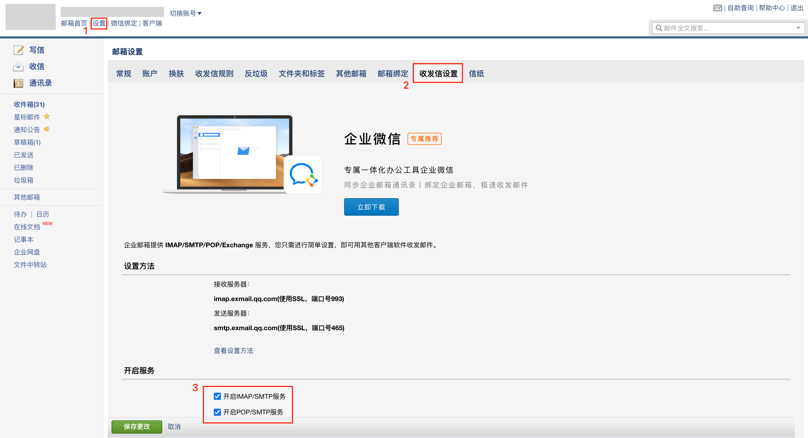
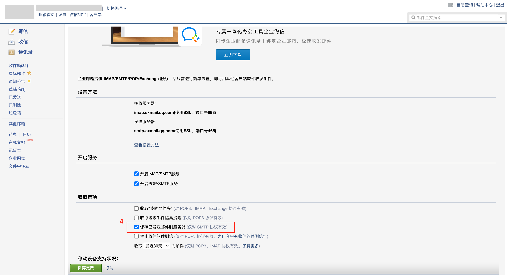
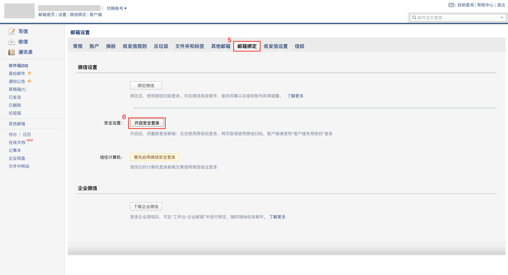
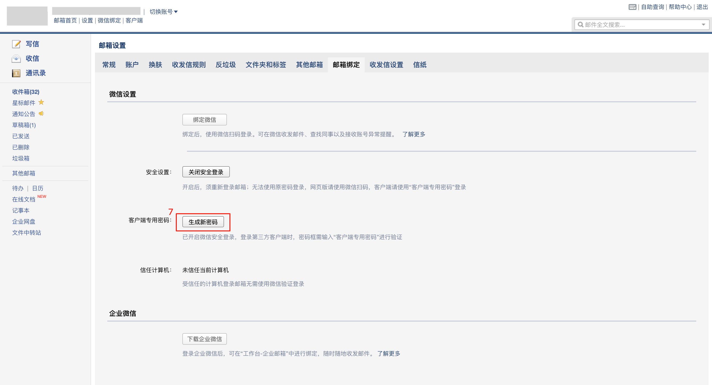
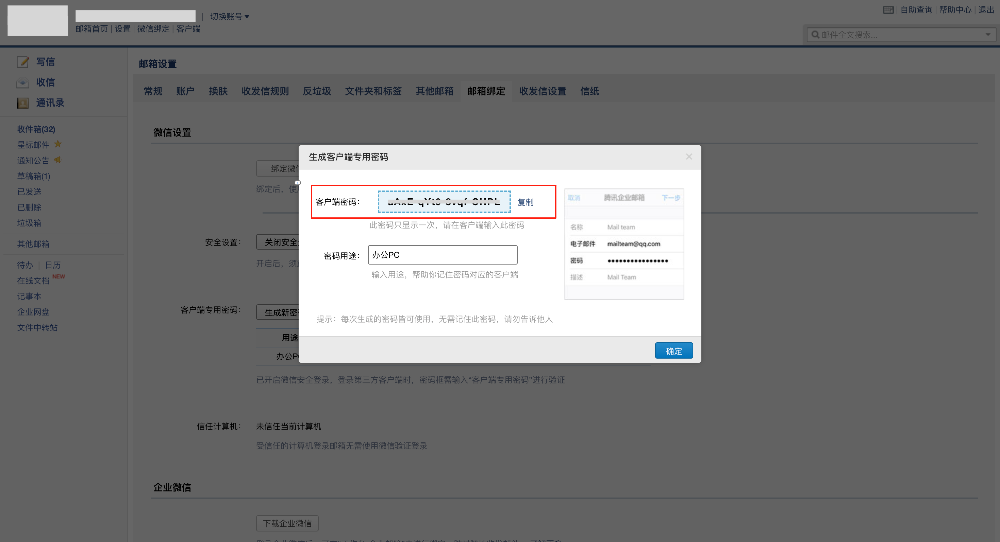

# 邮箱批量自动发送邮件脚本

本项目通过 Python 脚本批量发送邮件，支持多个收件人、抄送人、附件自动创建、是否发送控制等功能。适用于企业通知、会议纪要、客户群发等应用场景。

---

## 功能特性

- 支持从 Excel 表格中读取每封邮件的收件人、抄送人、标题、正文、附件名称
- 支持多个收件人、多个抄送人（用逗号分隔）
- 支持自定义“是否发送”字段跳过部分邮件
- 附件如不存在，将自动创建空文件以保证发送不出错
- 支持企业微信邮箱 SMTP 发送，兼容 Mac/Windows 环境

---

## 文件结构

```

emails/
├── emails_send.py           # 主程序脚本
├── email_config.json        # 邮箱配置文件
├── emails_comtent.xlsx      # 邮件信息数据表（需按模板填写）
├── attachments/             # 附件目录（脚本会自动创建缺失附件）
└── README.md                # 使用说明文档

````
---

## 邮箱配置文件说明（email\_config.json）

为避免将敏感信息（如邮箱账号、SMTP 密码）写入主脚本中，本项目将其独立保存为 `email_config.json`：

```json
{
  "email": "你的完整邮箱地址",
  "password": "你的SMTP授权码"
}
```

请将该文件放置于脚本同级目录下。

```
email_config.json
```

---

## 示例 Excel 输入格式

| 收件人邮箱              | 抄送人邮箱               | 邮件标题       | 邮件正文             | 附件名称         | 是否发送 |
|-------------------------|--------------------------|----------------|----------------------|------------------|----------|
| a@example.com           | b@example.com,c@abc.com  | 通知1          | 各位同事，请查收。   | 通知1.pdf        | Y        |
| x@example.com, y@abc.com |                          | 会议纪要2       | 附上会议内容。       | 纪要2.docx       | N        |

**字段说明：**

- **收件人邮箱**：多个收件人用英文逗号 `,` 或中文逗号 `，` 分隔
- **抄送人邮箱**：可为空，也支持多个邮箱地址同样使用逗号分隔
- **邮件标题**/**正文**：支持中英文，文本格式
- **附件名称**：填写文件名即可，文件应存放在 `attachments/` 目录下。若文件不存在将自动生成空文件
- **是否发送**：填写 `Y` 表示发送，`N` 表示跳过该行

---

## 如何运行

### 1. 安装依赖

```bash
pip install yagmail pandas openpyxl
````

### 2. 启动脚本

```bash
python3 emails_send.py
```

脚本会逐行读取 `emails_comtent.xlsx` 并根据“是否发送”字段决定是否发出邮件，控制台会显示收件人、抄送人、附件准备等信息。

---

## 如何在企业邮箱开启 SMTP 服务

若你是使用腾讯企业邮箱（如 `@yourcompany.com`），请按照以下步骤开启 SMTP 服务并获取客户端授权码：

### 步骤 1：进入邮箱设置页面，勾选启用 SMTP 服务

在网页版邮箱点击右上角【设置】，进入【收发信设置】

确认勾选：
* 启用 IMAP/SMTP 服务
* 启用 POP/SMTP 服务
  点击“保存更改”



---

### 步骤 2：勾选“保存已发送邮件到服务器”

这样发出的邮件将出现在“已发送”中（如需）


---

### 步骤 3：前往【邮箱绑定】生成客户端专用密码

点击【邮箱绑定】→ 启用安全登录 → 生成新密码
复制该密码用于脚本中 SMTP 登录




---

## SMTP 配置信息

| 配置项     | 值                  |
| ------- | ------------------ |
| SMTP服务器 | smtp.exmail.qq.com |
| 端口      | 465                |
| 加密方式    | SSL                |
| 用户名     | 你的完整企业邮箱地址         |
| 密码      | 客户端专用授权码           |

---

## 注意事项

* Excel 文件必须为 `.xlsx` 格式
* 脚本不会将邮件写入“已发送”文件夹（如需请手动开启 SMTP 服务中的“保存副本”选项）
* 如果发件失败，请确认网络是否通畅、SMTP 服务已开启，密码是否使用了授权码

---

## 常见问题

* **为什么发送成功但收件箱中没有已发送记录？**
  默认 SMTP 不会保存副本，你需在设置中勾选“保存已发送邮件到服务器”

* **我是否可以群发给多个地址？**
  是的，“收件人邮箱”与“抄送人邮箱”均支持多个地址，以逗号分隔

* **附件必须存在吗？**
  不必须，如文件不存在，脚本会自动生成空文件，不影响发送

---

## 联系方式

如需扩展功能（HTML 邮件支持、自动日志记录、多语言支持等），请联系w1321253871@gmail.com或提交issue。


